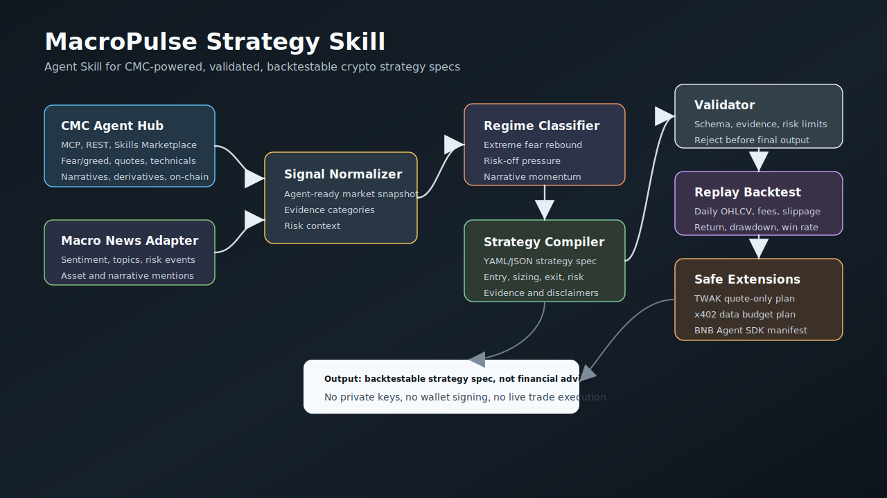
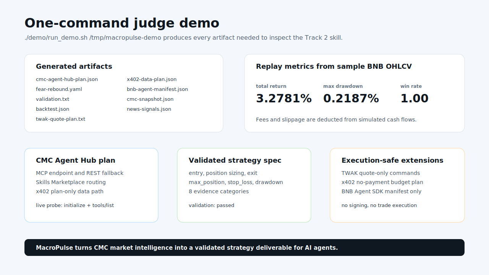
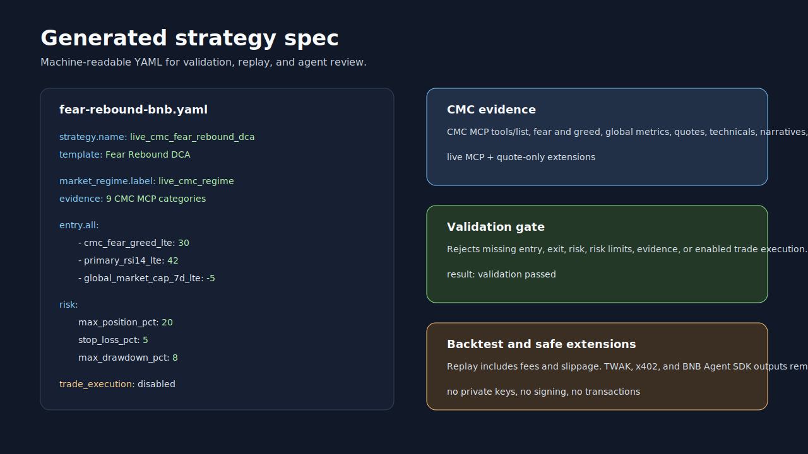
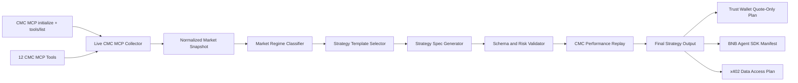

# MacroPulse Strategy Skill

MacroPulse Strategy Skill is an open-source BNB Hack Track 2 submission that turns live CoinMarketCap MCP market intelligence into validated, backtestable crypto strategy specifications for AI agents.

It is not an auto-trading app. It does not execute swaps, transfers, approvals, wallet signing, or private-key operations.

## Overview

MacroPulse packages a reusable Agent Skill in `macropulse-strategy/`. The skill collects live CoinMarketCap MCP data, classifies the market regime, selects a strategy template, generates a YAML/JSON strategy spec, validates risk controls, runs a lightweight replay, and emits safe extension artifacts for Trust Wallet Agent Kit and BNB Agent SDK.

The current implementation is live CMC MCP-first. It requires `CMC_MCP_API_KEY` or `CMC_API_KEY`; offline data fixtures are intentionally not used.

## Visual Assets







## Why This Exists

Most crypto agent demos jump from data to a natural-language recommendation. MacroPulse takes a stricter path:

```text
live CMC MCP tools -> market snapshot -> regime -> template -> strategy spec -> validator -> replay -> final report
```

The output is a backtestable strategy specification, not financial advice and not a buy/sell recommendation.

## BNB Hack Track 2 Fit

BNB Hack Track 2 asks for Strategy Skills: CMC Skills that generate trading strategies from market data and ship a backtestable spec rather than a live agent. MacroPulse directly targets that shape:

- Agent Skill package with `SKILL.md`, scripts, references, examples, and assets.
- Live CMC MCP data and pre-computed indicators as the signal layer.
- Strategy YAML/JSON output with evidence, entry, exit, execution assumptions, risk limits, validation, and replay metrics.
- Trust Wallet Agent Kit and BNB Agent SDK artifacts kept quote-only and manifest-only.

## What Is an Agent Skill?

An Agent Skill is a folder that gives an AI agent task-specific instructions, tools, references, and examples. MacroPulse's skill entry point is:

```text
macropulse-strategy/SKILL.md
```

The skill is designed so an agent can load the workflow, run deterministic scripts, and return an auditable strategy deliverable instead of improvising a trading recommendation.

## Key Features

- Live CoinMarketCap MCP collector that calls all 12 currently exposed CMC MCP tools.
- MCP tool discovery through `initialize` and `tools/list`.
- Fear and greed, global metrics, BNB/BTC/ETH quotes, technical analysis, derivatives, macro events, latest CMC news, trending narratives, holder metrics, semantic concept search, and market-cap technical analysis.
- Three strategy templates: Fear Rebound DCA, Risk-Off Rotation, and Narrative Momentum.
- YAML/JSON strategy generation with mandatory evidence and disclaimers.
- Validator for entry, exit, risk, evidence count, and disabled execution.
- Lightweight CMC MCP performance replay with fees and slippage assumptions.
- Trust Wallet Agent Kit quote-only command plan.
- x402 no-payment data access plan for future paid CMC request routing.
- BNB Agent SDK manifest-only deliverable.

## Architecture



The Mermaid source is stored at `macropulse-strategy/assets/architecture.mmd`.

## Sponsor Integrations

### CoinMarketCap AI Agent Hub

MacroPulse uses the CoinMarketCap MCP server as the primary data layer:

```text
https://mcp.coinmarketcap.com/mcp
```

The live collector validates and uses these MCP tools:

- `search_cryptos`
- `get_crypto_quotes_latest`
- `get_crypto_info`
- `get_crypto_metrics`
- `get_crypto_technical_analysis`
- `get_crypto_latest_news`
- `search_crypto_info`
- `get_global_metrics_latest`
- `get_global_crypto_derivatives_metrics`
- `get_upcoming_macro_events`
- `trending_crypto_narratives`
- `get_crypto_marketcap_technical_analysis`

MCP client configuration:

```json
{
  "mcpServers": {
    "cmc-mcp": {
      "url": "https://mcp.coinmarketcap.com/mcp",
      "headers": {
        "X-CMC-MCP-API-KEY": "your-api-key"
      }
    }
  }
}
```

Generate a CMC Agent Hub plan and live MCP probe:

```bash
python3 macropulse-strategy/scripts/cmc_agent_hub_plan.py --check-live --output /tmp/cmc-agent-hub-plan.json
```

### Trust Wallet Agent Kit

MacroPulse produces quote-only plans from strategy YAML:

```bash
python3 macropulse-strategy/scripts/twak_quote_plan.py --strategy /tmp/live-strategy.yaml
```

Example output commands:

```bash
npx @trustwallet/cli --version
twak price BNB
twak swap 100 USDC BNB --quote-only
twak alert create --token BNB --above <price>
twak alert create --token BNB --below <price>
```

The script only prints a plan. It does not call TWAK, sign transactions, or execute wallet actions.

### BNB Agent SDK

MacroPulse can emit a manifest-only extension artifact for BNB Agent SDK style packaging:

```bash
python3 macropulse-strategy/scripts/bnb_agent_manifest.py \
  --strategy /tmp/live-strategy.yaml \
  --output /tmp/bnb-agent-manifest.json
```

The manifest describes agent identity metadata, deliverables, acceptance criteria, and strategy hashes. It does not register anything on-chain.

## Repository Structure

```text
.
+-- README.md
+-- LICENSE
+-- requirements.txt
+-- demo/
|   +-- run_demo.sh
|   +-- demo-video-script.md
+-- macropulse-strategy/
    +-- SKILL.md
    +-- scripts/
    |   +-- collect_cmc_data.py
    |   +-- cmc_agent_hub_plan.py
    |   +-- generate_strategy.py
    |   +-- validate_strategy.py
    |   +-- backtest_strategy.py
    |   +-- twak_quote_plan.py
    |   +-- x402_data_plan.py
    |   +-- bnb_agent_manifest.py
    +-- references/
    +-- examples/
    +-- assets/
```

## Quickstart

Use Python 3.9 or newer. Python 3.10+ is recommended when available.

```bash
cd /path/to/bnbhack
python3 -m venv .venv
source .venv/bin/activate
pip install -r requirements.txt
```

Set your CMC key without committing it:

```bash
cat > .env <<'EOF'
CMC_MCP_API_KEY=replace_with_your_key
CMC_API_KEY=replace_with_your_key
EOF
```

Load it for the current shell:

```bash
set -a
. ./.env
set +a
```

Run the live pipeline:

```bash
python3 macropulse-strategy/scripts/collect_cmc_data.py \
  --assets BNB,BTC,ETH \
  --primary BNB \
  --output /tmp/live-cmc.json

python3 macropulse-strategy/scripts/generate_strategy.py \
  --cmc-snapshot /tmp/live-cmc.json \
  --output /tmp/live-strategy.yaml

python3 macropulse-strategy/scripts/validate_strategy.py \
  --strategy /tmp/live-strategy.yaml

python3 macropulse-strategy/scripts/backtest_strategy.py \
  --strategy /tmp/live-strategy.yaml \
  --cmc-snapshot /tmp/live-cmc.json

python3 macropulse-strategy/scripts/twak_quote_plan.py \
  --strategy /tmp/live-strategy.yaml
```

## Running the Judge Pipeline

The one-command judge pipeline loads `.env` if present and writes artifacts to the output directory:

```bash
PYTHON_BIN=.venv/bin/python ./demo/run_demo.sh /tmp/macropulse-live-demo
```

Artifacts:

```text
/tmp/macropulse-live-demo/cmc-agent-hub-plan.json
/tmp/macropulse-live-demo/cmc-snapshot.json
/tmp/macropulse-live-demo/fear-rebound.yaml
/tmp/macropulse-live-demo/validation.txt
/tmp/macropulse-live-demo/backtest.json
/tmp/macropulse-live-demo/twak-quote-plan.txt
/tmp/macropulse-live-demo/x402-data-plan.json
/tmp/macropulse-live-demo/bnb-agent-manifest.json
```

## Running with Live CoinMarketCap MCP Data

Collect a snapshot:

```bash
python3 macropulse-strategy/scripts/collect_cmc_data.py \
  --assets BNB,BTC,ETH \
  --primary BNB \
  --news-limit 5 \
  --output /tmp/live-cmc.json
```

Generate each template from the same live snapshot:

```bash
python3 macropulse-strategy/scripts/generate_strategy.py \
  --cmc-snapshot /tmp/live-cmc.json \
  --template fear-rebound-dca \
  --output /tmp/fear-rebound.yaml

python3 macropulse-strategy/scripts/generate_strategy.py \
  --cmc-snapshot /tmp/live-cmc.json \
  --template risk-off-rotation \
  --output /tmp/risk-off.yaml

python3 macropulse-strategy/scripts/generate_strategy.py \
  --cmc-snapshot /tmp/live-cmc.json \
  --template narrative-momentum \
  --output /tmp/narrative.yaml
```

You can also let the generator collect live MCP data directly:

```bash
python3 macropulse-strategy/scripts/generate_strategy.py --live --output /tmp/live-strategy.yaml
```

## Example Prompts

```text
Use MacroPulse Strategy Skill with live CMC MCP data for BNB, BTC, and ETH. Generate a 7-day strategy spec, validate it, run the CMC replay, and return risk limits and evidence.
```

```text
Generate a risk-off crypto rotation strategy from live CMC fear/greed, global metrics, BTC dominance, derivatives pressure, and BNB technical analysis.
```

```text
Use CMC trending narratives and latest CMC news to generate a narrative momentum strategy. Include liquidity filters, evidence, validation, replay metrics, and caveats.
```

```text
Convert this strategy YAML into a Trust Wallet Agent Kit quote-only plan. Do not execute any transaction.
```

More prompts are in `macropulse-strategy/references/demo-prompts.md`.

## Example Strategy Output

```yaml
strategy:
  name: live_cmc_fear_rebound_dca
  version: 2.0.0
  template: Fear Rebound DCA
asset_universe:
  primary:
    - BNB
    - BTC
    - ETH
  focus_asset: BNB
market_regime:
  label: extreme_fear_cmc_rebound_setup
  selected_template: fear-rebound-dca
evidence:
  - source: CoinMarketCap MCP tools inventory
  - source: CMC MCP get_global_metrics_latest
  - source: CMC MCP get_crypto_quotes_latest
entry:
  all:
    - cmc_fear_greed_lte: 30
    - primary_rsi14_lte: 42
execution:
  mode: specification_only
  trade_execution: disabled
  quote_only: true
exit:
  any:
    - cmc_fear_greed_gte: 55
    - take_profit_pct: 12
    - stop_loss_pct: 5
risk:
  max_position_pct: 20
  stop_loss_pct: 5
  max_drawdown_pct: 8
  fee_bps: 10
  slippage_bps: 8
```

Generated examples are stored in `macropulse-strategy/examples/`.

## Validation

Validate generated or saved live examples:

```bash
python3 macropulse-strategy/scripts/validate_strategy.py --strategy /tmp/live-strategy.yaml
python3 macropulse-strategy/scripts/validate_strategy.py --strategy macropulse-strategy/examples/fear-rebound-bnb.yaml
python3 macropulse-strategy/scripts/validate_strategy.py --strategy macropulse-strategy/examples/risk-off-rotation.yaml
python3 macropulse-strategy/scripts/validate_strategy.py --strategy macropulse-strategy/examples/narrative-momentum.yaml
```

The validator fails if:

- `entry`, `exit`, or `risk` is empty.
- `risk.max_position_pct`, `risk.stop_loss_pct`, or `risk.max_drawdown_pct` is missing.
- Fewer than two evidence items are present.
- Trade execution is enabled.

## Backtest / Replay

Run the CMC MCP performance replay:

```bash
python3 macropulse-strategy/scripts/backtest_strategy.py \
  --strategy /tmp/live-strategy.yaml \
  --cmc-snapshot /tmp/live-cmc.json
```

Example output fields:

```json
{
  "mode": "cmc_mcp_performance_replay",
  "focus_asset": "BNB",
  "total_return_pct": -0.4658,
  "max_drawdown_pct": 3.3187,
  "win_rate": 0.0,
  "trade_count": 6,
  "fees_paid_pct": 0.2,
  "slippage_assumption_bps": 8.0
}
```

This is a lightweight validation replay based on CMC MCP quote performance horizons. It is not a production quant engine.

## Trust Wallet Quote-Only Plan

```bash
python3 macropulse-strategy/scripts/twak_quote_plan.py --strategy /tmp/live-strategy.yaml
```

The output includes quote-only commands and a human approval checklist. It does not execute transactions.

## x402 Data Plan

```bash
python3 macropulse-strategy/scripts/x402_data_plan.py \
  --strategy /tmp/live-strategy.yaml \
  --max-budget-usdc 0.08
```

This produces a no-payment plan for possible CMC x402 data access. MacroPulse does not sign x402 payments.

## BNB Agent SDK Extension

```bash
python3 macropulse-strategy/scripts/bnb_agent_manifest.py \
  --strategy /tmp/live-strategy.yaml \
  --output /tmp/bnb-agent-manifest.json
```

This creates a manifest-only artifact for agent identity and deliverable packaging. It does not use private keys, escrow, or on-chain registration.

## Risk Model

Every valid strategy must include:

```yaml
risk:
  max_position_pct: 20
  stop_loss_pct: 5
  max_drawdown_pct: 8
```

Replay applies strategy-level fee and slippage assumptions:

```yaml
risk:
  fee_bps: 10
  slippage_bps: 8
```

See `macropulse-strategy/references/risk-model.md` for details.

## Limitations

- This project does not provide financial advice.
- This project does not execute trades.
- Live CMC MCP availability, limits, schemas, and rate limits depend on the user's CMC account and current CMC beta behavior.
- The replay engine uses quote performance horizons, not full venue order books or tick data.
- The strategy validator checks required structure and risk controls; it does not prove profitability.
- Trust Wallet, x402, and BNB Agent SDK outputs are safe extension artifacts, not autonomous execution.

## Security Notes

- Do not commit API keys, private keys, seed phrases, or secrets.
- `CMC_MCP_API_KEY` and `CMC_API_KEY` are read only from the environment.
- `.env` is ignored by `.gitignore`.
- TWAK output is quote-only and alert-only.
- Human review is required before any separate real-world execution workflow.

## Roadmap

- Add CI for live-key integration smoke tests with secret masking.
- Add richer replay adapters when CMC MCP exposes suitable historical bars for the current plan.
- Add stricter JSON Schema validation for generated strategy specs.
- Add optional CMC Skills Marketplace invocation when public skill routing APIs are available.
- Add a full BNB Agent SDK wrapper while preserving the no-execution boundary.

## License

MIT. See `LICENSE`.
