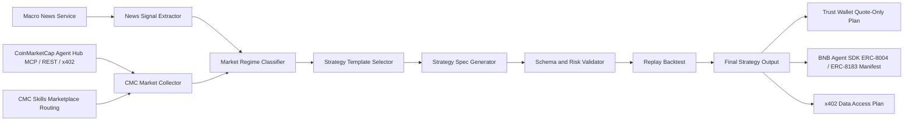

# MacroPulse Strategy Skill

MacroPulse Strategy Skill turns macroeconomic news, CoinMarketCap data, fear and greed signals, technical indicators, and crypto narratives into auditable, backtestable crypto strategy specifications for AI agents.

It is a BNB Hack Track 2 Strategy Skills submission. It is not an auto-trading app and it does not execute trades.

## Overview

MacroPulse helps an AI agent produce a machine-readable YAML or JSON strategy spec with:

- Market regime classification.
- Evidence from CoinMarketCap and macro news signals.
- Entry, position sizing, execution, exit, and risk rules.
- Mandatory risk limits.
- Lightweight replay/backtest metrics.
- Trust Wallet Agent Kit quote-only planning.

The default demo runs without API keys.

## Why This Exists

Most crypto agent demos jump from data to a natural-language recommendation. MacroPulse takes a stricter path:

```text
macro news + CMC market data -> regime -> template -> strategy spec -> validator -> replay -> final report
```

The output is a backtestable strategy specification, not a buy/sell recommendation.

## BNB Hack Track 2 Fit

Track 2 is about Strategy Skills. MacroPulse is packaged as an Agent Skill folder with `SKILL.md`, scripts, references, examples, and assets. The project shows how an agent can generate, validate, and replay strategy specs using sponsor-relevant crypto data while keeping execution out of scope.

## What Is an Agent Skill?

An Agent Skill is a reusable folder that gives an AI agent task-specific workflow instructions, scripts, references, and examples. In this repository, the skill lives in:

```text
macropulse-strategy/
```

The required entry point is:

```text
macropulse-strategy/SKILL.md
```

## Key Features

- Demo mode with no API key.
- CoinMarketCap live collector with `CMC_API_KEY` environment variable.
- CoinMarketCap Agent Hub plan for MCP, Skills Marketplace, REST, and x402 routing.
- News signal extractor with sample and future HTTP adapter modes.
- Three strategy templates:
  - Fear Rebound DCA
  - Risk-Off Rotation
  - Narrative Momentum
- YAML/JSON strategy generation.
- Schema and risk validation.
- Lightweight OHLCV replay with fee and slippage assumptions.
- Trust Wallet Agent Kit quote-only plan output.
- BNB Agent SDK ERC-8004/ERC-8183 manifest output.
- One-command demo script for judges.
- Clear no-financial-advice and no-trade-execution constraints.

## Architecture



The Mermaid source is also stored at `macropulse-strategy/assets/architecture.mmd`.

## Sponsor Integrations

### CoinMarketCap AI Agent Hub

MacroPulse is designed around CoinMarketCap market context:

- Fear and Greed.
- Global market metrics.
- BNB/BTC/ETH quotes.
- Technical indicator fields.
- Trending narratives.
- Future MCP/AI Agent Hub enrichment for historical and narrative data.

The project now includes a CMC Agent Hub plan that maps MCP, REST, Skills Marketplace, and x402 into strategy fields:

```bash
python macropulse-strategy/scripts/cmc_agent_hub_plan.py --output /tmp/cmc-agent-hub-plan.json
```

With `CMC_MCP_API_KEY` or `CMC_API_KEY`, it can also probe the MCP endpoint:

```bash
python macropulse-strategy/scripts/cmc_agent_hub_plan.py --check-live
```

The live REST collector attempts CMC endpoints when `CMC_API_KEY` is set. Without a key, it falls back to `examples/sample-cmc-snapshot.json`.

### Trust Wallet Agent Kit

The project includes `scripts/twak_quote_plan.py`, which converts a strategy spec into quote-only commands such as:

```bash
npx @trustwallet/cli --version
twak price BNB
twak swap 100 USDC BNB --quote-only
twak alert create --token BNB --above 686.7840
twak alert create --token BNB --below 582.5400
```

It never executes swaps, transfers, approvals, or wallet actions.

### BNB Agent SDK

The repository includes `scripts/bnb_agent_manifest.py`, which emits a manifest for BNB Agent SDK ERC-8004 identity metadata and ERC-8183-style deliverable packaging:

```bash
python macropulse-strategy/scripts/bnb_agent_manifest.py \
  --strategy /tmp/fear-rebound.yaml \
  --output /tmp/bnb-agent-manifest.json
```

This is manifest-only. It does not load private keys, register on-chain, fund escrow, or settle payments.

## Repository Structure

```text
.
+-- README.md
+-- LICENSE
+-- requirements.txt
+-- demo/
    +-- run_demo.sh
    +-- demo-video-script.md
+-- macropulse-strategy/
    +-- SKILL.md
    +-- scripts/
    |   +-- collect_cmc_data.py
    |   +-- cmc_agent_hub_plan.py
    |   +-- extract_news_signals.py
    |   +-- generate_strategy.py
    |   +-- validate_strategy.py
    |   +-- backtest_strategy.py
    |   +-- twak_quote_plan.py
    |   +-- x402_data_plan.py
    |   +-- bnb_agent_manifest.py
    +-- references/
    +-- examples/
    +-- assets/
```

## Quickstart

Use Python 3.10 or newer when available. The scripts also run on Python 3.9 in demo mode.

```bash
cd /path/to/bnbhack
python3 -m venv .venv
source .venv/bin/activate
pip install -r requirements.txt
```

After activation, `python` should resolve to the virtual environment Python:

```bash
python macropulse-strategy/scripts/generate_strategy.py --demo --output /tmp/fear-rebound.yaml
python macropulse-strategy/scripts/validate_strategy.py --strategy /tmp/fear-rebound.yaml
python macropulse-strategy/scripts/backtest_strategy.py --strategy /tmp/fear-rebound.yaml --demo
python macropulse-strategy/scripts/twak_quote_plan.py --strategy /tmp/fear-rebound.yaml
python macropulse-strategy/scripts/cmc_agent_hub_plan.py --output /tmp/cmc-agent-hub-plan.json
python macropulse-strategy/scripts/x402_data_plan.py --strategy /tmp/fear-rebound.yaml
python macropulse-strategy/scripts/bnb_agent_manifest.py --strategy /tmp/fear-rebound.yaml
```

If your shell has no `python` command before activation, use `python3` for the venv creation step.

## Judge Demo

Run the complete demo pipeline:

```bash
./demo/run_demo.sh /tmp/macropulse-demo
```

Artifacts:

```text
/tmp/macropulse-demo/cmc-agent-hub-plan.json
/tmp/macropulse-demo/cmc-snapshot.json
/tmp/macropulse-demo/news-signals.json
/tmp/macropulse-demo/fear-rebound.yaml
/tmp/macropulse-demo/validation.txt
/tmp/macropulse-demo/backtest.json
/tmp/macropulse-demo/twak-quote-plan.txt
/tmp/macropulse-demo/x402-data-plan.json
/tmp/macropulse-demo/bnb-agent-manifest.json
```

The demo video script is in `demo/demo-video-script.md`.

## Running in Demo Mode

Demo mode uses:

```text
macropulse-strategy/examples/sample-news-input.json
macropulse-strategy/examples/sample-cmc-snapshot.json
macropulse-strategy/examples/sample-bnb-ohlcv.csv
```

Generate each template:

```bash
python macropulse-strategy/scripts/generate_strategy.py --demo --template fear-rebound-dca
python macropulse-strategy/scripts/generate_strategy.py --demo --template risk-off-rotation
python macropulse-strategy/scripts/generate_strategy.py --demo --template narrative-momentum
```

Bundled example outputs:

```text
macropulse-strategy/examples/fear-rebound-bnb.yaml
macropulse-strategy/examples/risk-off-rotation.yaml
macropulse-strategy/examples/narrative-momentum.yaml
```

## Running with Live CoinMarketCap Data

Set your API key in the environment:

```bash
export CMC_API_KEY="your_key_here"
```

Collect a live snapshot:

```bash
python macropulse-strategy/scripts/collect_cmc_data.py \
  --assets BNB,BTC,ETH \
  --include fear-greed,global,quotes,technicals,narratives \
  --output /tmp/cmc-live.json
```

Generate a strategy from live CMC data and sample news:

```bash
python macropulse-strategy/scripts/generate_strategy.py \
  --input macropulse-strategy/examples/sample-news-input.json \
  --cmc-snapshot /tmp/cmc-live.json \
  --output /tmp/live-strategy.yaml
```

If the key is missing or live requests fail, the collector prints a clear message and uses the sample snapshot instead.

## CoinMarketCap Agent Hub / MCP / x402

MacroPulse aligns with CMC Agent Hub by treating CMC as the data and capability layer, not just a raw JSON API.

MCP config:

```json
{
  "mcpServers": {
    "cmc-mcp": {
      "url": "https://mcp.coinmarketcap.com/mcp",
      "headers": {
        "X-CMC-MCP-API-KEY": "your-api-key"
      }
    }
  }
}
```

Generate the routing plan:

```bash
python macropulse-strategy/scripts/cmc_agent_hub_plan.py
```

Generate an x402 no-payment plan:

```bash
python macropulse-strategy/scripts/x402_data_plan.py --strategy /tmp/fear-rebound.yaml
```

MacroPulse does not sign x402 payments. It emits request categories, budget guardrails, and acceptance checks so a separate agent runtime can decide whether to pay for CMC data.

## Example Prompts

```text
Generate a 7-day BNB strategy using macro news, CMC fear/greed, and market technicals.
```

```text
Create a risk-off crypto strategy for a week with CPI and FOMC risk.
```

```text
Use CMC trending narratives and my news feed to find a narrative momentum strategy.
```

```text
Convert this strategy into a Trust Wallet quote-only execution plan.
```

More judge-friendly prompts are in `macropulse-strategy/references/demo-prompts.md`.

## Example Strategy Output

```yaml
strategy:
  name: fear_rebound_bnb_dca
  version: 1.0.0
  template: Fear Rebound DCA
asset_universe:
  primary:
    - BNB
    - BTC
    - ETH
market_regime:
  label: extreme_fear_rebound
  confidence: 0.707
entry:
  all:
    - cmc_fear_greed_lte: 30
    - bnb_rsi_14_lte: 40
    - bnb_7d_change_lte_pct: -4
    - news_macro_sentiment_gte: -0.35
execution:
  mode: specification_only
  trade_execution: disabled
  quote_only: true
  type: dca
position_sizing:
  method: dca_equal_slices
  allocation_per_entry_pct: 4
  max_position_pct: 20
exit:
  any:
    - cmc_fear_greed_gte: 55
    - take_profit_pct: 12
    - stop_loss_pct: 5
risk:
  max_position_pct: 20
  stop_loss_pct: 5
  max_drawdown_pct: 8
  fee_bps: 10
  slippage_bps: 8
```

Full examples are in `macropulse-strategy/examples/`.

## Validation

Validate generated or bundled strategies:

```bash
python macropulse-strategy/scripts/validate_strategy.py --strategy /tmp/fear-rebound.yaml
python macropulse-strategy/scripts/validate_strategy.py --strategy macropulse-strategy/examples/fear-rebound-bnb.yaml
python macropulse-strategy/scripts/validate_strategy.py --strategy macropulse-strategy/examples/risk-off-rotation.yaml
python macropulse-strategy/scripts/validate_strategy.py --strategy macropulse-strategy/examples/narrative-momentum.yaml
```

The validator fails if:

- `entry`, `exit`, or `risk` is empty.
- `risk.max_position_pct`, `risk.stop_loss_pct`, or `risk.max_drawdown_pct` is missing.
- Fewer than two evidence items are present.
- Trade execution is enabled.

## Backtest / Replay

Run the lightweight replay:

```bash
python macropulse-strategy/scripts/backtest_strategy.py --strategy /tmp/fear-rebound.yaml --demo
```

Example metrics from the bundled BNB sample:

```json
{
  "total_return_pct": 3.2781,
  "max_drawdown_pct": 0.2187,
  "win_rate": 1.0,
  "trade_count": 4,
  "fees_paid_pct": 0.1404,
  "slippage_assumption_bps": 8.0
}
```

This is a lightweight daily OHLCV replay for validation. It is not a production quant engine.

## Trust Wallet Quote-Only Plan

```bash
python macropulse-strategy/scripts/twak_quote_plan.py --strategy /tmp/fear-rebound.yaml
```

The output includes quote-only commands and an approval checklist. It does not call TWAK directly and does not execute transactions.

## x402 Data Plan

```bash
python macropulse-strategy/scripts/x402_data_plan.py \
  --strategy /tmp/fear-rebound.yaml \
  --max-budget-usdc 0.08
```

This produces a no-payment plan for CMC pay-per-request data access over x402. It is useful when an agent has USDC on Base but no CMC API key.

## BNB Agent SDK Extension

Future work can wrap the skill as a BNB Chain agent service:

- Register agent identity and metadata.
- Expose strategy generation as a job.
- Attach strategy YAML, validation output, replay metrics, and evidence as deliverables.
- Keep real execution separate from this strategy skill.

Generate the manifest-only extension artifact:

```bash
python macropulse-strategy/scripts/bnb_agent_manifest.py --strategy /tmp/fear-rebound.yaml
```

## Risk Model

Every valid strategy must include:

```yaml
risk:
  max_position_pct: 20
  stop_loss_pct: 5
  max_drawdown_pct: 8
```

Replay applies fee and slippage assumptions from the strategy:

```yaml
risk:
  fee_bps: 10
  slippage_bps: 8
```

See `macropulse-strategy/references/risk-model.md` for details.

## Limitations

- This project does not provide financial advice.
- This project does not execute trades.
- Demo data is synthetic and should not be treated as live market truth.
- The replay engine is intentionally lightweight and daily-bar based.
- Live CMC technicals and narratives may require CoinMarketCap AI Agent Hub or MCP enrichment beyond the basic REST collector.
- Strategy semantics are only partially validated. The validator checks structure and required risk controls.

## Security Notes

- Do not commit API keys, private keys, seed phrases, or secrets.
- `CMC_API_KEY` is read only from the environment.
- `.env` files are ignored by `.gitignore`.
- TWAK output is quote-only and alert-only.
- Human review is required before any separate real-world execution workflow.

## Roadmap

- Add JSON Schema export for stricter validation.
- Add richer CMC MCP adapters for historical fear/greed, technicals, and narratives.
- Add more replay data adapters for BTC, ETH, and portfolio rotation.
- Add a BNB Agent SDK identity and deliverable wrapper.
- Add CI tests for all sample strategies and scripts.

## License

MIT. See `LICENSE`.
